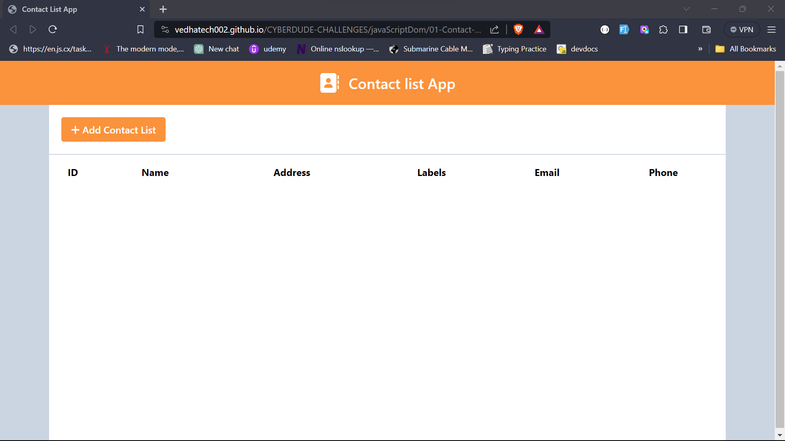
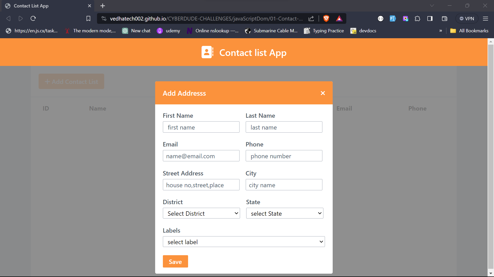
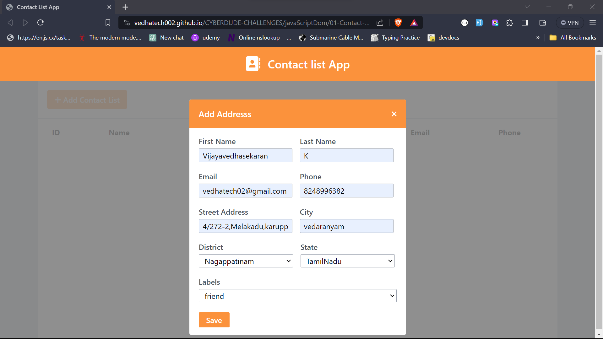
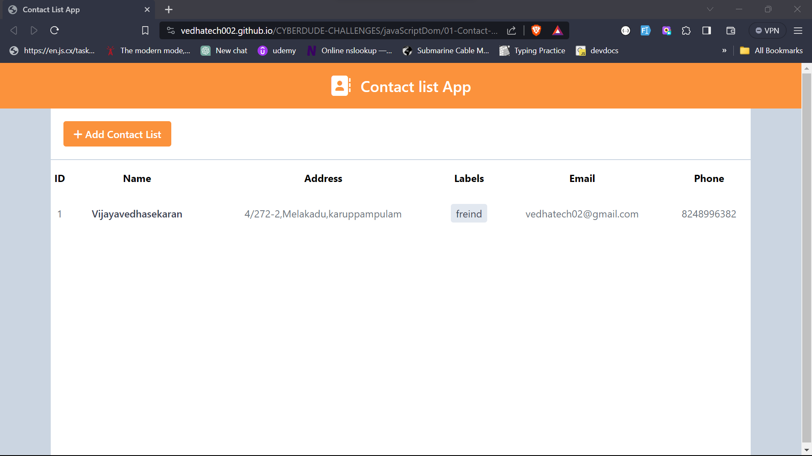

# Contact list App

This challenge is part of free internship (Fullstack Engineer) offered by [CyberDude Networks Pvt. Ltd.](https://cyberdudenetworks.com) You can find all the source code and live links below.

> Task : Create a form and log the form data in console .

#### Screen shots

- <p>Home page</p>



- <p>modal form</p>



- <p>form validation</p>


- <p>input datas</p>



- <p>contact list</p>



#### Live link ->

check out [live preview ](https://vedhatech002.github.io/CYBERDUDE-CHALLENGES/javaScriptDom/01-Contact-list-forms/dist/)

```js

```

## Acknowledgement:

- [@AnbuSelvan](https://github.com/anburocky3) | GitHub Profile.
